# Nexa AI

<p align="center">
  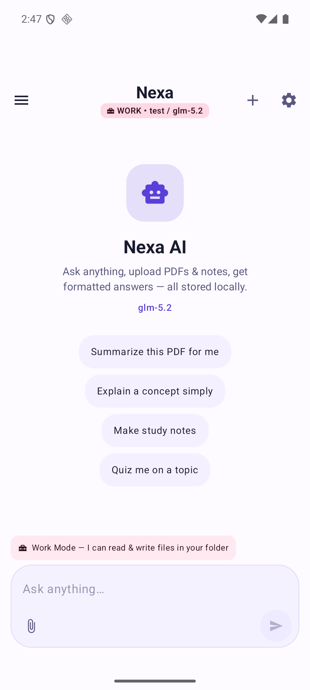
  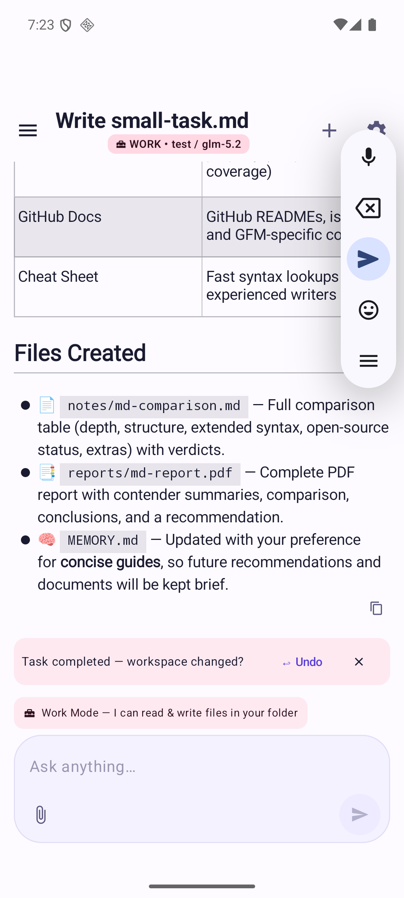
  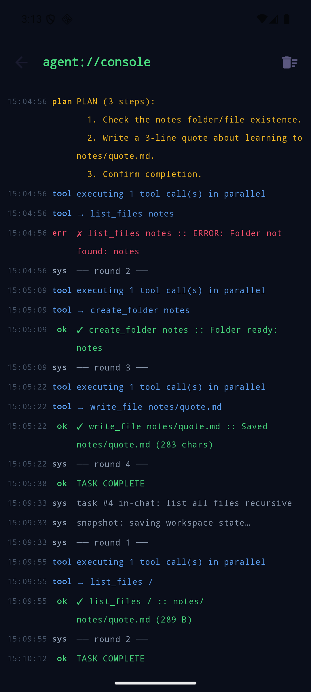
</p>

A privacy-first AI chat + agent app for Android. Bring your own API key — no accounts, no logins, no tracking. Everything is stored on your device; the only thing that ever leaves it is your prompt, sent straight to whichever AI provider you configure.

Kotlin + Jetpack Compose, Material 3. Single activity, no heavyweight frameworks.

## Why I built this

Every AI chat app either wants your account, your data, or a subscription. I wanted the opposite: a client that works with *any* OpenAI-compatible API, keeps every chat in a local database, and — the fun part — can actually *do things* on the device, not just talk. That became Work Mode.

## Features

### Chat
- Streaming responses with full markdown rendering (tables, code blocks, links)
- Multiple providers — anything that speaks the OpenAI chat-completions format works: OpenAI, Groq, OpenRouter, Ollama (local), Top Tools AI, etc. Add as many as you want, switch between them freely
- Switch models mid-conversation from a bottom sheet
- Connection tester right in the provider editor (with real error output, so a bad key tells you *why* it's bad)
- Chat history in a local Room DB, one-tap copy on any reply
- PDF / TXT / MD / CSV upload as context — text extracted fully on-device (PDFBox)

### Work Mode — the agent part
Flip the toggle, pick a folder, and the model gets real file tools scoped to it:

- Create, read, append, overwrite, delete files and folders
- Generate actual PDF documents
- Web search via DuckDuckGo (no API key, no cost) + fetch any page's text
- Long-term memory — the agent keeps its own `MEMORY.md` and carries what it learns across sessions
- Self-planning when it matters: small tasks ("write a quick note") run directly, multi-step work (research + multiple files + reports) gets a numbered plan shown as a live checklist that ticks off as it works
- Parallel tool execution, with retries and exponential backoff on network hiccups
- Smart context compaction so long tasks don't blow up the token count

Before every task it snapshots the workspace. Task went sideways? One-tap **Undo** restores the previous state — files it created get removed, files it changed get restored.

<p align="center">
  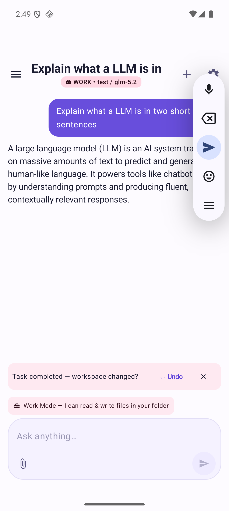
  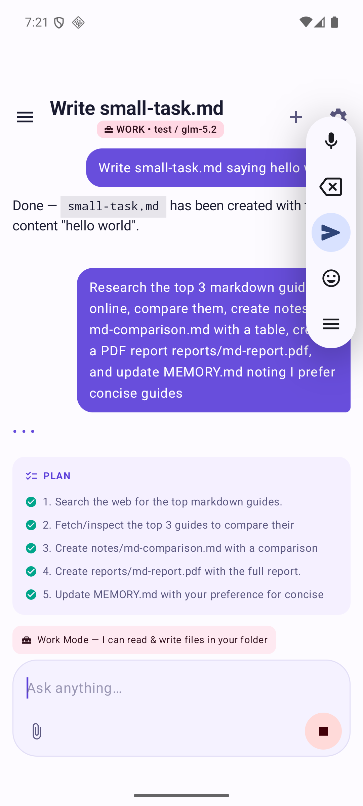
  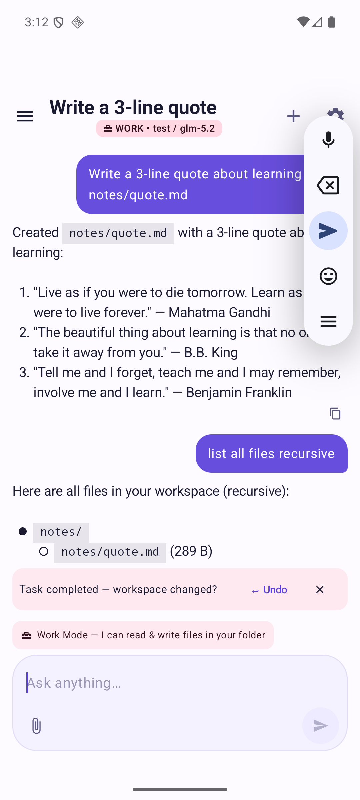
</p>

*Example of a real agentic run — asked to "research the top 3 markdown guides, compare them, create a comparison table, a PDF report, and update memory": the agent planned 5 steps, searched the web, fetched pages, wrote `notes/md-comparison.md`, generated `reports/md-report.pdf`, and updated its own `MEMORY.md`. Small tasks skip the ceremony entirely.*

### Agent tasks & scheduling
- Queue one-shot jobs ("research X and save notes") or daily recurring ones ("every morning, check my notes folder")
- Runs through WorkManager — works in the background, survives restarts, notifies you on completion
- Task list with live status (queued → running → done/failed) and result previews

<p align="center">
  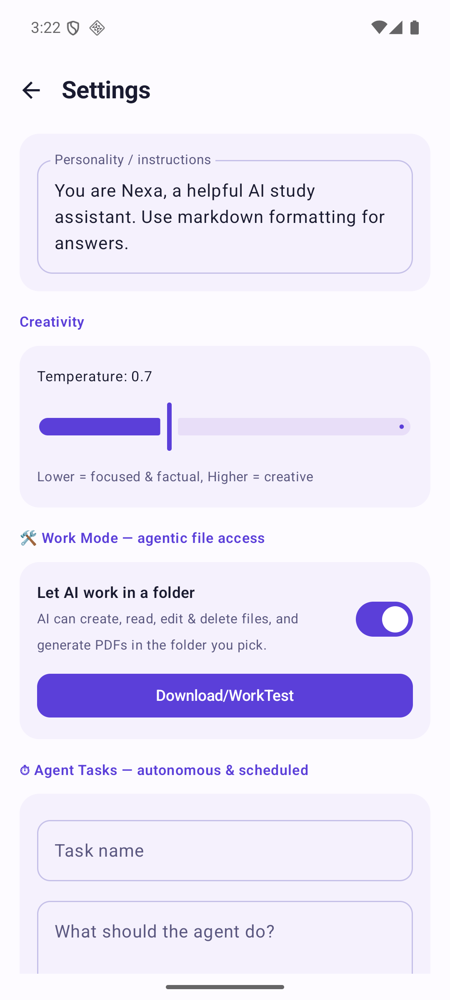
  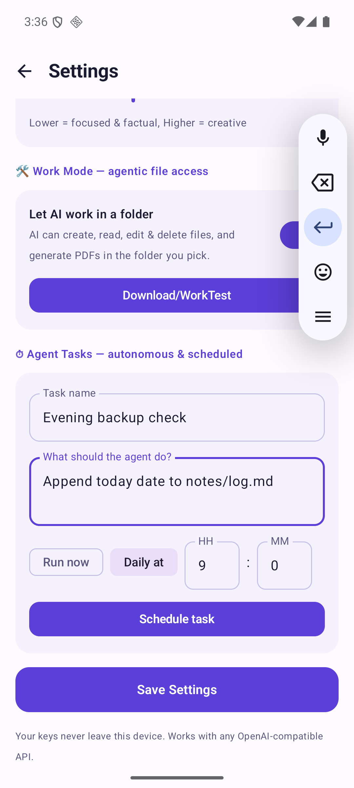
  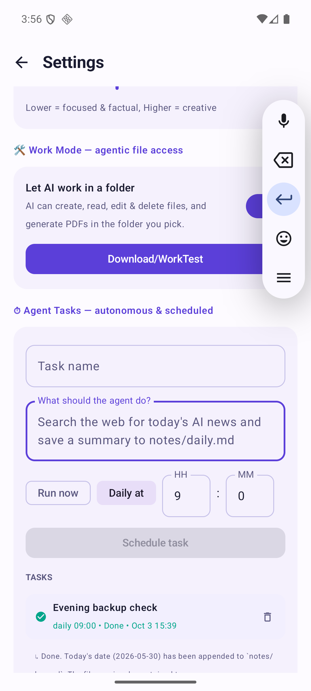
</p>

### Agent Console
A terminal-style log of everything the agent does — every tool call, every result, every retry, round by round. If the agent did something, you can see exactly what and when.

<p align="center">
  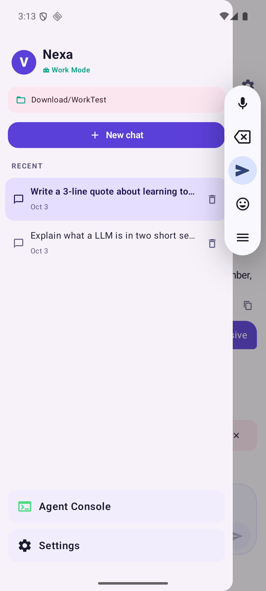
  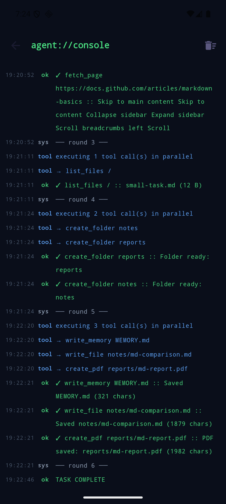
  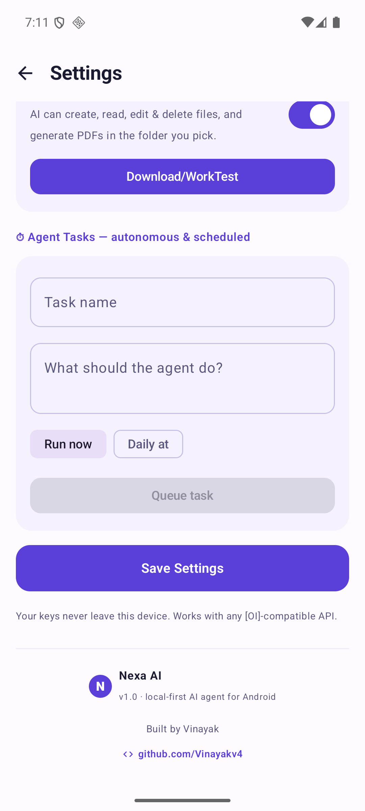
</p>

## Building

Open in Android Studio and run, or:

```
./gradlew assembleDebug
```

JDK 17, min SDK 26 (Android 8.0). Debug APK lands in `app/build/outputs/apk/debug/`.

## Setting it up

1. Open the app → you land in Settings → **Add provider**
2. Fill in a name, base URL (e.g. `https://api.openai.com/v1` or `https://api.groq.com/openai/v1`), your API key, and model IDs — one per line
3. Hit **Test** to verify, then **Save**
4. Optional: enable **Work Mode**, pick a folder (via the system folder picker — the app gets persistent access to that folder only)

For a fully local setup, point a provider at Ollama (`http://localhost:8899/v1` or similar if you forward it through adb) and nothing ever leaves the device.

## How the agent works, briefly

The agent doesn't use native tool-calling — it uses a text protocol instead, which makes it work with *any* model, including ones without function-calling support. The system prompt tells the model it can emit `<tool>{"name":"write_file","args":{...}}</tool>` blocks. The engine:

1. Forces a first reply containing a `<plan>` block
2. Streams tokens, filtering tool/plan tags out of the visible text
3. Parses tool blocks with a brace-matching parser (tolerates truncation)
4. Executes calls in parallel on IO dispatchers
5. Feeds results back as `TOOL_RESULTS` and loops until the model answers without tools
6. Caps at 12 rounds, snapshots the workspace before starting

## Notes

- API keys live in DataStore on-device, never synced, never logged
- The agent is sandboxed to the SAF folder you grant — it physically cannot read or write anything else
- Snapshots are stored in app-private storage, capped at ~40MB
- Notifications are optional; deny the permission and tasks still run silently
- License: MIT
